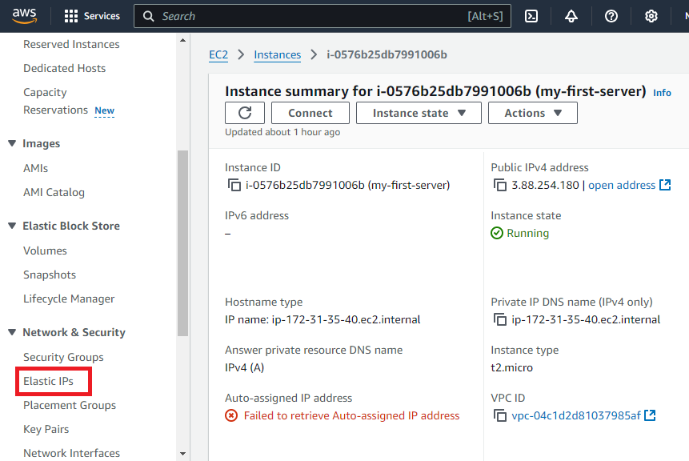

# Instalación de pila LAMP en Ubuntu Server

## Pasos preliminares

### Creación de instancia EC2

1. Inicia el laboratorio.
2. Abre la consola haciendo clic en el texto "AWS".
   
3. Presiona el botón "EC2".
   
4. Presiona el botón "Launch instance".
   
5. Introduce el nombre de la instancia.
   
6. Selecciona la AMI (Amazon Machine Image), la arquitectura (x86 o Arm), y la imagen **Ubuntu Server 22.04 LTS (HVM), SSD Volume Type, 64-bit (x86)**.
   
7. Selecciona el tipo de instancia **t2.micro** (1 vCPU y 1 GiB de RAM) y la clave pública asociada a la cuenta de AWS Learner Lab.
   
8. Deja los valores por defecto para la red. Crea un nuevo grupo de seguridad y configura las reglas para permitir tráfico **SSH, HTTP y HTTPS**, tal como se muestra en la imagen.
   
9. Usa un disco SSD de **8 GB** (el que está seleccionado por defecto).
   
10. Revisa la configuración en el apartado "Summary" y pulsa el botón "Launch instance".
   
11. Ve a la lista de instancias para comprobar el estado de la instancia. Si está en ejecución, haz clic sobre la instancia y pulsa "Connect".
   
12. En la ventana de conexión, selecciona la opción "SSH client" y copia el comando del ejemplo.
   
13. Ve al laboratorio, haz clic en "AWS Details" y pulsa el botón "pem'key" para descargarlo.
   
14. Cambia el nombre de la clave descargada a **vockey.pem** con el siguiente comando:
   ```bash
   $ mv labuser.pem vockey.pem
   ```
15. Cambia los permisos del archivo para que solo el propietario tenga permisos de lectura:
   ```bash
   $ chmod 400 vockey.pem
   ```
16. Conéctate por SSH a tu instancia usando el comando obtenido en el paso 12:
```bash
$ ssh -i "vockey.pem" ubuntu@ec2-3-88-254-180.compute-1.amazonaws.com
```
17. En la consola de AWS, ve al servicio EC2.
En el panel izquierdo, busca y haz clic en Elastic IPs:
   
18. Haz clic en Allocate para generar una nueva dirección IP elástica:
   
   
19. Después de asignar la IP, selecciona la nueva dirección IP elástica en la lista.
Haz clic en el botón Actions y selecciona Associate Elastic IP address.
   
20. Selecciona tu instancia EC2 de la lista y haz clic en Associate (Asociar) para vincular la dirección IP elástica a tu instancia.
   

## Instalación automática de la pila LAMP

### 1 Instalación de Apache Web Server
### 1.1 Actualización de la lista de paquetes
``` bash
apt update 
```
### 1.2 Actualización de los paquetes instalados a últimas versiones
```bash
apt upgrade -y
```
### 1.3 Instalación de Apache Web Server
``` bash
apt install apache2 -y
```
Después de la instalación, Apache se inicia automáticamente y comienza a escuchar en el puerto **80**. 
La configuración del puerto se puede ver y cambiar en el archivo /etc/apache2/ports.conf

**1.3.1** Crea un archivo de configuración de host virtual 000-default.conf en la carpeta conf del proyecto. Este archivo define cómo Apache manejará las peticiones  de un sitio web, incluido su directorio raíz, nombre de dominio y opciones de registro (log).
La plantilla básica de este archivo se ve así:
```
<VirtualHost *:80>
    ServerName www.example.com
    # Especifica para qué dominio se procesará este host

    ServerAdmin webmaster@localhost
    # Correo electrónico del administrador del sitio

    DocumentRoot /var/www/html
    # Directorio donde se encuentran todos los recursos del sitio

    ErrorLog ${APACHE_LOG_DIR}/error.log
    # Archivo en el que se escribirán los registros de errores de este host virtual

    CustomLog ${APACHE_LOG_DIR}/access.log combined
    # Archivo en el que se escribirán los registros de acceso al sitio
</VirtualHost>
```

**1.3.2** Copia este archivo al directorio /etc/apache2/sites-available para configurar el host virtual.

Si insertas la IP de su servidor en la barra de direcciones del navegador, verás la página predeterminada de Apache.


### 1.4 Instalación de modulo PHP
PHP es un módulo Apache (libapache2-mod-php) que permite a Apache procesar scripts PHP y una extensión para trabajar con MySQL (php-mysql).
``` bash
apt install php libapache2-mod-php php-mysql -y
```

### 1.5 Habilitación del modulo rewrite de Apache
Este módulo permite reescribir las URLs y configurar reglas de redireccionamiento, para hacer las URLS más amigables y mejorar el SEO de los sitios web.
``` bash
a2enmod rewrite
```

### 1.6 Aplicación de los cambios de configuración
Reinicia Apache para aplicar los cambios realizados en la configuración (por ejemplo, después de habilitar un módulo o cambiar hosts virtuales)
``` bash
systemctl restart apache2
```

### 1.7 Cambio de los permisos
Cambia el propietario del directorio /var/www/html a www-data (el usuario de Apache) para que el servidor tenga los derechos necesarios para acceder y modificar los archivos del sitio.
``` bash
chown -R www-data:www-data /var/www/html
```

### 1.8 Instalación de MySQL Server
``` bash
apt install mysql-server -y
```

### 2 Instalación automática de los herramientas adicionales
### 2.1 Instalación de phpMyAdmin
**2.1.1** Configuración de instalación automática con la herramienta ```debconf-set-selections```
La utilidad ```debconf-set-selections``` nos permite automatizar las respuestas que dará el usuario durante del proceso de instalación. 

En el caso de phpmyadmin las respuestas que queremos automatizar son las siguientes:

a. Seleccionar el servidor web que queremos configurar para ejecutar
``` bash 
echo "phpmyadmin phpmyadmin/reconfigure-webserver multiselect apache2" | debconf-set-selections
```
b. Confirmar que desea utilizar dbconfig-common para configurar la base de datos
``` bash
echo "phpmyadmin phpmyadmin/dbconfig-install boolean true" | debconf-set-selections
```
c. Seleccionar la contraseña para phpMyAdmin
``` bash
echo "phpmyadmin phpmyadmin/mysql/app-pass password $PHPMYADMIN_APP_PASSWORD" | debconf-set-selections
echo "phpmyadmin phpmyadmin/app-password-confirm password $PHPMYADMIN_APP_PASSWORD" | debconf-set-selections
```
En este ejemplo estamos guardando la contraseña en la variable de entorno $PHPMYADMIN_APP_PASSWORD que tendremos que configurar previamente asignándole un valor inicial.
**2.1.2** Instalación de phpMyAdmin
``` bash
sudo apt install phpmyadmin php-mbstring php-zip php-gd php-json php-curl -y
```

### 2.2 Instalación de Adminer
Adminer es una versión simplificada de phpMyAdmin. Sirve para acceder a MySQL a traves de web.
**2.2.1**  Crea un directorio llamado adminer dentro del directorio /var/www/html.
``` bash
mkdir -p /var/www/html/adminer
```
**2.2.2** Descarga Adminer en este directorio.
```
wget https://github.com/vrana/adminer/releases/download/v4.8.1/adminer-4.8.1-mysql.php -P /var/www/html/adminer
```
**2.2.3** Cambia el nombre del archivo Adminer a index.php para que se abra automáticamente como página de inicio.
```
mv /var/www/html/adminer/adminer-4.8.1-mysql.php /var/www/html/adminer/index.php
```
Si ingresas ```tu_servidor_ip/adminer``` en la barra de navegador, vas a ver lo siguente
   

### 2.3 Creación de bases de datos y configuración de acceso a bases de datos
**2.3.1** Eliminar la base de datos con el nombre especificado en .env, si existe.
```
mysql -u root <<< "DROP DATABASE IF EXISTS $DB_NAME"
```
**2.3.2** Crea una nueva base de datos con este nombre.
```
mysql -u root <<< "CREATE DATABASE $DB_NAME"
```
**2.3.3** Elimina el usuario de la base de datos si existe.
```
mysql -u root <<< "DROP USER IF EXISTS '$DB_USER'@'%'"
```
**2.3.4** Crea un nuevo usuario de base de datos con el nombre y la contraseña especificados en .env.
```
mysql -u root <<< "CREATE USER '$DB_USER'@'%' IDENTIFIED BY '$DB_PASSWORD'"
```
**2.3.5** Otorga a este usuario acceso completo a la base de datos.
```
mysql -u root <<< "GRANT ALL PRIVILEGES ON $DB_NAME.* TO '$DB_USER'@'%'"
```
### 2.4 Instalación de GoAccess
**2.4.1** GoAccess es una herramienta para procesar los archivos de log access.log de Apache. Se instala con el comando
```
sudo apt install goaccess -y
```
**2.4.2** Para ver los informes de GoAccess crea un directorio
```
mkdir -p /var/www/html/stats
```
**2.4.3** Para analizar el archivo access.log y generar un archivo HTML en tiempo real, y para que GoAccess siga ejecutándose independientemente de la sesión, usa el comando
```
goaccess /var/log/apache2/access.log -o /var/www/html/report.html --log-format=COMBINED --real-time-html --daemonize
```
**NOTA BENE:** Para poder generar el archivo HTML en tiempo real, abre el puerto 7890 en el firewall para que el WebSocket de JavaScript pueda comunicarse con la aplicación de GoAccess.

- Ve a la instancia, haz clic en Security y elige el grupo de seguridad de la instancia.
   
- Haz clic en Edit inbound rules.
   
- En la página siguiente, pulsa Add rule y agrega el puerto 7890 como Custom TCP con la IP 0.0.0.0.
- Haz clic a Save rules

### 2.5 Control de acceso a un directorio con .htaccess
Los archivos .htaccess permiten realizar cambios en la configuración del servidor web Apache sin tener que modificar los archivos principales de configuración. 
**2.5.1** Crea el archivo .htacess con la estructura siguente
``` bash
AuthType Basic               
# Autenticación básica HTTP
AuthName "Acceso restringido" 
# Mensaje que se mostrará al solicitar credenciales
AuthBasicProvider file        
# Utiliza un archivo como proveedor de autenticación
AuthUserFile "/etc/apache2/.htpasswd" 
# Ruta del archivo que contiene usuarios y contraseñas
Require valid-user            
# Solo permite el acceso a usuarios autenticados
```
**2.5.2** Crea el archivo para guardar las contraseñas del usuario que accederá al directorio stats.
```
sudo htpasswd -bc /etc/apache2/.htpasswd $STATS_USERNAME $STATS_PASSWORD
```
**2.5.2** Crea el nuevo archivo de configuración ```000-default-htaccess.conf```, que incluye la siguiente instrucción dentro de las etiquetas <VirtualHost *:80> y </VirtualHost>:
``` sh
  <Directory "/var/www/html/stats">
    AllowOverride All
    #permite el uso de archivos .htaccess en la carpeta especificada
  </Directory>
```
**2.5.3** Copia nuevo archivo de configuración a ```sites-available```. 
```
cp ../conf/000-default-htaccess.conf /etc/apache2/sites-available
```
**2.5.4** Deshabilita la configuración previa de VirtualHost y habilita la nueva para aplicar el control de acceso. Reinicia el servicio Apache para aplicar la nueva configuración.
```
a2dissite 000-default.conf
a2ensite 000-default-stats.conf
systemctl reload apache2
```
